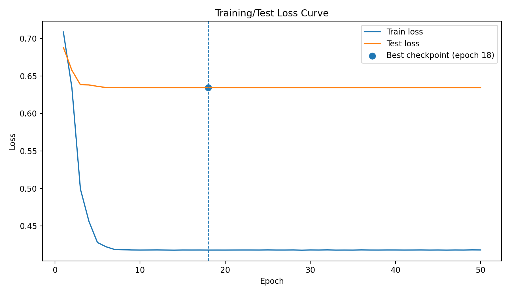

# Atlas-Free Brain Network Transformer  
**Admission Assignment – Dr. Shuai Huang (Auburn University)**

## 1. Introduction

This project implements an **atlas-free brain network transformer** described in [the original paper](https://arxiv.org/pdf/2510.03306). The pipeline includes data validation, model training, and evaluation with a strict heldout protocol to ensure reproducibility and prevent data leakage. This repository was developed as an **admission assignment** and emphasizes clarity, correctness, and experimental rigor.

---

## 2. Requirements

- Python ≥ 3.9  
- PyTorch
- NumPy  
- SciPy  
- scikit-learn  

Recommended OS: Windows (developed and tested), should also work on Linux  

---

## 3. Data
### 3.1 Data Description
500 subjects are given for the assignment. Each subject is represented by:
 - An ROI feature matrix of shape [400, 1632]
 - A cluster index tensor encoding 3D spatial structure
 - A binary classification label (1, 2) (Labels are mapped to (0,1) during training and evaluation)

Labels are loaded from a MATLAB file and converted to zero-based indexing.

### 3.2 Folder Organization
To run the pipeline, please keep the `data/` folder in the following format:
```text
data/
├── label.mat
├── s_1_feature.mat
├── s_1_cluster_index.mat
├── s_2_feature.mat
├── s_2_cluster_index.mat
├── ...
```
### 3.3 Excluded Data
The following subject indices are excluded because their ROI feature matrices do not match the shape [400, 1632]:
```python
[4, 6, 173, 175, 211, 232, 293, 319, 344, 378, 381, 391, 427, 461]
```
These subjects are removed prior to dataset splitting.

### 3.4 Dataset Splits
The dataset was **stratified by class labels** and split as follows:

| Split     | Ratio | # Subjects |
|----------|-------|------------|
| Train    | 70%   |   343      |
| Test     | 15%   |   73       |
| Held-out | 15%   |   73       |

---
## 4. Model Architecture
The model is implemented in `model.py` and includes the following components.
### 4.1 ROI Feature Projection
```python
self.FNN = nn.Sequential(
    nn.Linear(self.roi_in_dim, self.roi_embed_dim),
    nn.GELU()
)
```
It projects the raw ROI features (1632-dim) into an embedding space (roi_embed_dim).
### 4.2 3D Pooling
```python
self.sumpool3d = nn.AvgPool3d(
    kernel_size=self.K,
    stride=self.stride,
    divisor_override=1
)
```
It aggregates spatial neighborhoods in the 3D ROI index tensor to reduce resolution while preserving spatial structure.

### 4.3 Transformer Encoder
```python
self.enc_layer = nn.TransformerEncoderLayer(
    d_model=roi_embed_dim,
    nhead=self.n_heads,
    dim_feedforward=roi_embed_dim * ff_mult,
    dropout=dropout,
    batch_first=True
)

self.encoder = nn.TransformerEncoder(
    self.enc_layer,
    num_layers=n_layers
)

```
It encodes pooled ROI embeddings using multi-head self-attention to model long-range dependencies.

### 4.4 Classification Head
```python
self.classifier = nn.Linear(roi_embed_dim, num_classes)
```
It applies a linear classifier on the aggregated subject embedding.

---
## 5. Training Setup
### Hyperparameters

| Parameter      | Value              |
|----------------|--------------------|
| Optimizer      | AdamW              |
|Starting Learning Rate  | 5e-5       |
| Batch Size     | 4                  |
| Epochs         | 50                 |
| Weight Decay   | 1e-2               |
| Loss Function  | CrossEntropyLoss   |
| Scheduler      | StepLR             |
| Step Size      | 2                  |
| Gamma          | 0.1                |

### Notes
- Overfitting occurs quickly due to limited dataset size  
- A **StepLR** scheduler is used to decay the learning rate every **2 epochs** by a factor of **0.1**  

## 6. Usage
Use the following command line to evaluate the data:
- To evaluate on the heldout subjects, run the following:
```text
python evaluate.py --data_dir {data_folder_path} --mode "heldout"
```
- To evaluate on all subjects in the folder, run the following:
```text
python evaluate.py --data_dir {data_folder_path} --mode "all"
```
---
## 7. Results
### 7.1 Loss Curves and Checkpoint Selection

The following figure shows the training and testing loss curves across epochs.  
The **best checkpoint** was selected based on the **lowest testing loss**, which occurred at **Epoch 18**.



The selected checkpoint corresponds to the first minimum of the test loss curve, balancing model performance and overfitting avoidance.

### 7.2 Held-out Set Performance

The following results are reported on the **held-out subject set**, which was not used during training or model selection.

```text
Number of Subjects : 73
Accuracy           : 0.6438
AUROC              : 0.6787
F1 Score           : 0.6486
Precision          : 0.6316
Recall             : 0.6667
```
Despite reduced performance compared to the original paper, the results are consistent with expectations given the significantly smaller dataset size.